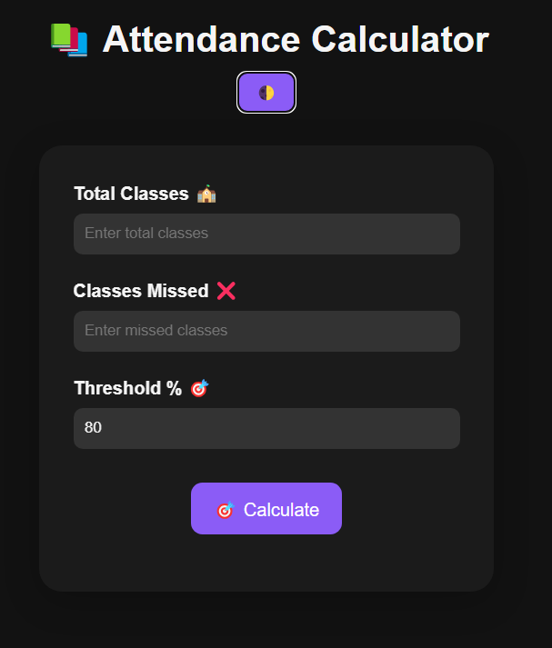

# 🎯 Smart Attendance Calculator

Hey there! 👋  
Tired of manually calculating your attendance? Worry no more — **Smart Attendance Calculator** is here to make your life easier, faster, and smarter! 🧠⚡

---

## 🚀 Why This App?
Managing attendance shouldn't feel like solving a math problem.  
This tool calculates your current attendance, tells you how many classes you need to attend to hit your target 🎯, and it's installable just like a real app!

---

## 🛠️ Built With
- **HTML5** — for clean structure
- **CSS3** — with smooth animations and dark/light theme
- **JavaScript ES6** — smart calculations at your fingertips
- **PWA Ready** — install it and use offline!

---

## ✨ Features
- 🌗 **Light/Dark Mode** — switch based on your mood!
- 🧮 **Instant Attendance Calculator**
- 🎯 **Target Predictor** — reach your threshold without guessing
- 📱 **Installable App** — Add to Home Screen in 1 click
- ⚡ **Blazing Fast and Minimal**

---

## 📸 App Preview



---

## 📥 Installation Guide

If you want to run it locally:

1. Clone the repository
   ```bash
   git clone https://github.com/technovore007/Attendance-calculator.git
